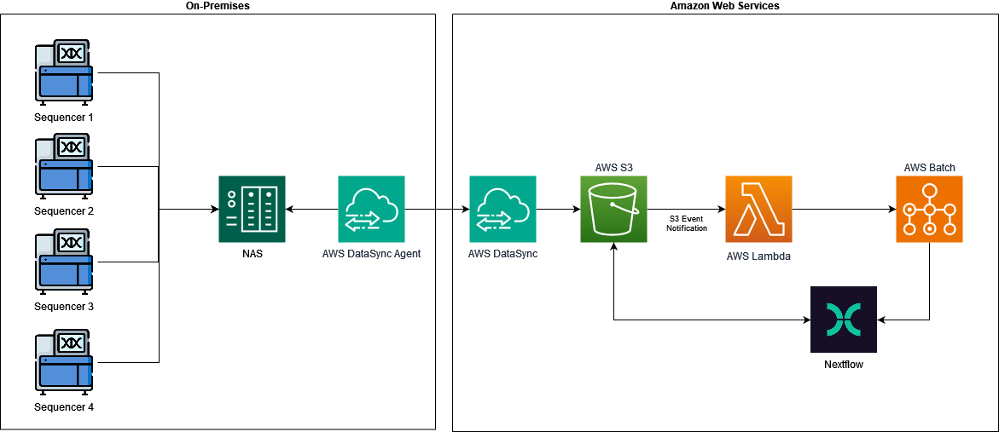

# GeneXOmics - Single-Cell CRISPR 10x Genomics wiht Chromium GEM-X Single Cell 5' Pipeline 

This repository contains a Nextflow pipeline designed to process single-cell RNA-seq data from a **CRISPR screening** experiment using **Perturb-seq**. The data consists of **1K A375 cells**, a human cell line stably expressing dCas9, transduced with either non-targeting or Rab1a sgRNA.

Gene expression and CRISPR libraries were generated with the [Chromium GEM-X Single Cell 5' Reagent Kits v3](https://cdn.10xgenomics.com/image/upload/v1710231431/support-documents/CG000735_ChromiumGEM-X_SingleCell5_ReagentKitsv3_CRISPR_UserGuide_RevA.pdf) and sequenced on an **Illumina NovaSeq6000**, resulting in ~80,000 read pairs per cell.

**Perturb-seq** combines CRISPR screening with single-cell RNA-seq to link sgRNAs directly to gene expression changes at single-cell resolution, allowing for high-throughput, efficient exploration of transcriptomic effects from genetic perturbations. 

The pipeline performs quality control, alignment, and quantification of gene expression and CRISPR guide activity.

## Pipeline Overview 

The pipeline follows three main steps:

1. Installing dependencies.
2. Example inputs and outputs.
3. Step-by-step guide to running the pipeline.

# Dependencies

This pipeline requires the following tools to be installed:

### 1. **Nextflow**
Nextflow is a workflow management system that allows you to write and manage complex pipelines in a simple and scalable way.

#### Installation:
Nextflow can be installed using the following command:

```bash
# Download and install Nextflow
curl -s https://get.nextflow.io | bash

# Move Nextflow to a directory in your PATH
mv nextflow /usr/local/bin/

# Verify installation
nextflow -version
```

For more details, visit the [Nextflow documentation](https://www.nextflow.io/docs/latest/index.html)

### 2. **FastQC**

FastQC is a quality control tool for high throughput sequence data, providing quick and easy visualizations of the quality of raw sequencing data. 

```bash
# For Ubuntu/Debian
sudo apt-get install fastqc

# For MacOS (using Homebrew)
brew install fastqc

# Verify installation
fastqc --version
```
Alternatively, you can download it from the FastQC official website and install it manually.

### 3. **Cell Ranger**

Cell Ranger is a set of analysis pipelines from 10x Genomics used for processing single-cell RNA-seq data. It handles tasks like demultiplexing, alignment, and quantification of gene expression and CRISPR guide activity.

In this pipeline, we use **Cell Ranger Multi**, which allows the simultaneous analysis of multiple libraries or data types. This is especially useful for experiments that involve both **Gene Expression (GEX)** and **CRISPR Screening** data, as it enables the integration of different data types in a single run.

Installation:

You must manualy download the package from the official [page](https://www.10xgenomics.com/support/software/cell-ranger/downloads#download-links).

```bash
# Extract the downloaded archive:
tar -xzvf cellranger-8.0.1.tar.gz

# Move it to a directory in your PATH (or add it to your PATH variable):

mv cellranger-8.0.1 /usr/local/bin/cellranger

# Add cellranger to your PATH (in .bashrc or .zshrc)
export PATH=/usr/local/bin/cellranger:$PATH

# Verify installation
cellranger --version
```

For more details on installation and configuration, refer to the [Cell Ranger installation guide](https://www.10xgenomics.com/support/software/cell-ranger/latest/analysis/running-pipelines/cr-3p-multi). Make sure all dependencies are correctly installed and available in your PATH before running the pipeline.


### Cell Ranger Multi Config CSV

The **Cell Ranger Multi** pipeline requires a configuration CSV `multi_config.csv` file to specify input paths and analysis parameters. This CSV file is divided into sections, including `[gene-expression]` and `[libraries]`, which define the reference genome, FASTQ paths, and feature types to be analyzed.

`1k_CRISPR_5p_gemx_Multiplex_config.csv`

#### Example Config CSV Layout:

```ini
[gene-expression]
reference,/path/to/transcriptome
create-bam,true

[libraries]
fastq_id,fastqs,feature_types
gex1,/path/to/fastqs,Gene Expression
crispr1,/path/to/fastqs,CRISPR Guide Capture

```
`[gene-expression]`:  Defines the path to the reference genome and whether BAM files should be generated.


To run the **Cell Ranger Multi** pipeline, you will need a compatible reference genome from 10x Genomics. Follow these steps to download the reference genome:

1. **Visit the 10x Genomics Reference Data Page**:
   Go to the official 10x Genomics [Reference Data page](https://support.10xgenomics.com/single-cell-gene-expression/software/downloads/latest) to find the latest reference genomes compatible with Cell Ranger.

2. **Choose the appropriate reference**:
   Select the reference genome that matches your species and the analysis you are running (e.g., human, mouse, etc.). For example, for human, download **GRCh38 (Human) reference**.

3. **Download the reference**:
   You can download the reference using the following command (adjust the URL for the specific genome version you need):

   ```bash

   #/mnt/deck/1/public_data/cellranger-8.0.0/references/GRCh38-2024-A

   wget -O refdata-gex-GRCh38-2020-A.tar.gz https://cf.10xgenomics.com/supp/cell-exp/refdata-gex-GRCh38-2020-A.tar.gz

   
`[libraries]` section: Specifies the FASTQ files and the type of data, such as Gene Expression or CRISPR Guide Capture.

For more configuration options, refer to the [10x Genomics Multi Config CSV Options.](https://www.10xgenomics.com/support/software/cell-ranger/latest/analysis/inputs/cr-multi-config-csv-opts)

### To run Cell Ranger Multi, 

you will need a configuration CSV file that defines the libraries and data types (e.g., GEX and CRISPR). Use the following command to run the multi pipeline:
```bas
cellranger multi --id=sample_name --csv=multi_config.csv
```

## How to Run the Pipeline with Nextflow

To execute the **GeneXOmics Single-Cell CRISPR 10x Genomics Pipeline**, follow these steps:

1. **Clone the repository**: First, clone this repository to your local machine and navigate to the root directory:

    ```bash
    git clone https://github.com/your-repo/GenXomics_single_cell_pipeline.git
    cd GenXomics_single_cell_pipeline
    ```

2. **Download the input data**: Navigate to the `data` folder and run the `data_download.sh` script to download the necessary datasets:

    ```bash
    ./data_download.sh
    ```

    This script will download the required FASTQ files and configuration CSVs for the analysis.

3. **Prepare the Multi Config CSV**: Ensure that the `multi_config.csv` file is correctly set up in the root directory. This file defines the input paths for the FASTQ files, reference genomes, and features for gene expression and CRISPR screening. Refer to the example and instructions above to configure this file.

4. **Execute the pipeline**: Run the pipeline using Nextflow from the root directory of the repository:

    ```bash
    nextflow run main.nf -profile local
    ```

    This will process the input data through the steps defined in the pipeline (FastQC, Cell Ranger Multi, etc.).

5. **View the results**: Once the pipeline finishes running, the output files (such as BAM files, count matrices, and QC reports) will be available in the `results` folder.

For troubleshooting or additional options, make sure all dependencies (Nextflow, FastQC, Cell Ranger Multi) are correctly installed and paths are properly configured.

Please note that running the pipeline may take some time, as the provided dataset consists of 16 files for this example. For more details about the dataset and the experimental setup, refer to the [data_description.md](data/data_description.md) file.

## How to run on AWS

This considers that we already have an S3 bucket and a Batch service properly configured. You must edit the `nextflow.config` file in order to provide the AWS parameters. If you plan to run this from your local machine, then you must configure the aws cli and set up your connection credentials.

1. **Clone the repository**: First, clone this repository to your local machine and navigate to the root directory:

    ```bash
    git clone https://github.com/your-repo/GenXomics_single_cell_pipeline.git
    cd GenXomics_single_cell_pipeline
    ```

2. **Download the input data**: Navigate to the `data` folder and run the `data_download.sh` script to download the necessary datasets:

    ```bash
    ./data_download.sh
    ```

    This script will download the required FASTQ files and configuration CSVs for the analysis.

3. **Prepare the Multi Config CSV**: Ensure that the `multi_config.csv` file is correctly set up in the root directory. This file defines the input paths for the FASTQ files, reference genomes, and features for gene expression and CRISPR screening. Refer to the example and instructions above to configure this file.

4. **Execute the pipeline**: Run the pipeline using Nextflow from the root directory of the repository:

    ```bash
    nextflow run main.nf -profile cloud
    ```

    This will process the input data through the steps defined in the pipeline (FastQC, Cell Ranger Multi, etc.).

In order to deploy and execute all the pipeline from AWS, then your Lambda function must configure the Batch service to execute

```bash
nextflow run your-repo/GenXomics_single_cell_pipeline --files <FILES_LOCATION_IN_S3> --reads <CSV_CONFIF_FILE_IN_S3>
```

# Architecture

The following diagram contains the suggested architecture to deploy the pipeline to AWS.


It considers four AWS Services: DataSync, S3, Lambda and Batch. This is the minimal viable architecture for this Nextflow pipeline.

## Architecture Details
* As mentioned there are four sequencers that write output files to a NAS.
* The AWS DataSync Agent can be configured to monitor the NAS to detect file changes.
* Once the DataSync Agent detects a change, it communicates with DataSync on AWS, so it can write the files to the S3 bucket. We can create an special folder named landing.
* A S3 Event Notification can be configured to trigger a Lambda function every time a new file is present in the S3 Bucket.
* The Lambda service can be configured to pass the bucket name and the new file name to the Batch service, so then, it can trigger the Nextflow execution.
* The Batch service must contain job definition, job queues and compute environments. Here, we define the docker container with the required dependencies already installed, so, when we launch the job, it can run all the steps in the pipeline. It is required a EC2 Compute Environment to run the containers.
* The docker container contains at least the following packages:
    1. nextflow
    1. aws cli
    1. fastqc
    1. cellranger
    1. quilt3

  In order to connect to the Benchling and Smartsheets services, we also must install the SDKs to use their APIs. They can be included directly in the nextflow pipeline definition.

  A sample Dockerfile to create the container in AWS is presented in [Dockerfile](Docker/Dockerfile). Note that the cellranger must be downloaded manualy from the official [page](https://www.10xgenomics.com/support/software/cell-ranger/downloads#download-links)

  > The container must be uploaded to the AWS ECR so it can be found by the Batch service.

# AWS Cost analysis

You can find the cost details on the [Estimate.csv](Estimate.csv) file.
